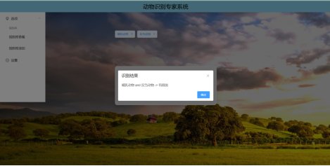
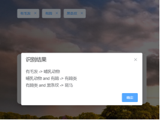
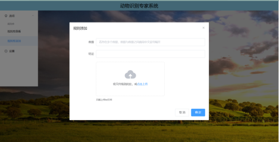
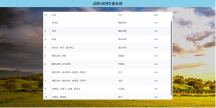

# 动物识别专家系统

#### 介绍
动物识别专家系统，使用Python flask框架作为后天服务器，vue作为前台web展示结果，更改自GitHub上的项目，进行了一些改进和优化，人工智能导论课程作业

#### 软件架构
服务器端 <-> 客户端

#### 安装教程
- 运行flask.py文件
- 运行 命令 ` npm run server`

#### 软件功能

1.  实现动物识别并返回识别的动物的种类

2.  实现通过上传指定格式文本实现批量上传规则
3.  自定义添加知识库里的知识

4. 删除知识库里的知识

#### 参与贡献

1.  欢迎各位同学前来改进

### 参考
#### 预览地址地址：（服务器只有1Mbps的带宽，第一次打开大约20秒左右）
[http://8.130.137.131:8080/#/](http://8.130.137.131:8080/#/)

参考博客：
[https://blog.csdn.net/Zhangguohao666/article/details/105423594](https://blog.csdn.net/Zhangguohao666/article/details/105423594)

github原项目：
[https://github.com/haocibuni/Animal-identification-expert-system](https://github.com/haocibuni/Animal-identification-expert-system)

